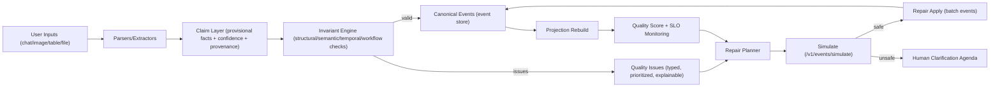

# Decision 13: Self-Healing Agentic Data Plane

Status: **Proposed** (2026-02-11)

## Goal

Build a system that remains:

1. **Flexible at the edge** (any conversation shape, any modality, imperfect agents)
2. **Structured at the core** (clean, queryable, repairable backend state)
3. **Self-correcting over time** (detects drift, proposes/executes repairs, verifies outcomes)

without giving up event-sourcing principles.

## Context

Real usage is combinatorial:
- users answer differently,
- tasks jump across onboarding/coaching/logging,
- inputs can be text, image, table, files,
- agents can forget, hallucinate, or over-assume.

The system must treat this as normal operating reality, not as edge cases.

## Design Thesis

Use a **permeable edge + strict core** architecture.

- **Permeable edge**: allow messy, partial, multimodal signals.
- **Strict core**: enforce invariants before data is considered trustworthy.
- **Self-healing loop**: continuously scan, repair, and verify.

This is the "self-organizing cell" model: adaptable membrane, regulated nucleus.

## Existing Foundation to Reuse

Kura already has critical primitives:
- append-only event log + compensating correction (`event.retracted`)
- batch writes (`/v1/events/batch`)
- dry-run impact simulation (`/v1/events/simulate`)
- data-quality and orphan detection in projections
- agenda surface in `user_profile` for agent action routing

Decision 13 extends this with explicit quality governance and repair protocols.

## Target Architecture



## Decision 13.1: Two-Tier Truth Model

Introduce explicit distinction:

- **Claim**: "what was extracted/interpreted"
- **Canonical fact event**: "what is accepted as durable truth"

Claims are allowed to be noisy. Canonical events are not.

### Proposed Claim Envelope

```json
{
  "claim_type": "profile.age",
  "value": 38,
  "unit": "years",
  "confidence": 0.93,
  "source": {
    "modality": "chat",
    "message_ref": "conversation:123#msg:45",
    "extractor": "agent_v2",
    "extractor_version": "2026-02-11"
  },
  "timestamp": "2026-02-11T12:12:00Z"
}
```

Claims can be converted automatically into canonical events only when policy allows.

## Decision 13.2: Invariants as First-Class Product Contract

Define invariant catalog with severity and repair behavior.
No invariant = no guaranteed data quality.

### Invariant Classes

1. **Structural**: event shape, required metadata, parseability
2. **Semantic**: canonical identity, type compatibility, trackability
3. **Temporal**: timezone/date/week consistency, chronology
4. **Workflow**: phase boundaries, commit handshakes, read-after-write guarantees

### Starter Invariant Catalog

| ID | Invariant | Severity | Auto-repair |
|----|-----------|----------|-------------|
| `INV-001` | `set.logged` should resolve to canonical exercise identity (`exercise_id` or known alias) | high | propose alias mapping + replay |
| `INV-002` | Agent cannot claim "saved" without persisted event id and read-back confirmation | high | block response template, force verify step |
| `INV-003` | User-facing schedule/date math must use explicit user timezone | high | require timezone preference; otherwise ask/assume with disclosure |
| `INV-004` | Onboarding-to-planning transition requires explicit phase close signal | medium | emit transition agenda item |
| `INV-005` | Goal must have measurable tracking path (native dimension or custom projection rule) | medium | propose tracking rule or explicit "not trackable yet" status |
| `INV-006` | Profile fields that influence programming (age/body metrics) must be explicit known/unknown/deferred | medium | create deferred markers instead of silent omission |
| `INV-007` | Plan writes must include idempotency key + post-write projection check | high | enforce write wrapper |
| `INV-009` | Visualization output requires intent trigger + bound projection sources + deterministic fallback | medium | skip or fallback to ASCII, emit confusion telemetry |

## Decision 13.3: Self-Healing Loop (Continuous Housekeeping)

Add dedicated quality loop:

1. **Detect**: scan latest events/projections against invariants
2. **Diagnose**: classify issues (`missing_identity`, `temporal_mismatch`, `workflow_violation`, ...)
3. **Propose**: generate minimal repair event batch
4. **Simulate**: run through `/v1/events/simulate`
5. **Apply**: only low-risk repairs auto-apply; risky repairs require user confirmation
6. **Verify**: rerun checks; close issue only when invariant is green

### Issue Lifecycle

`detected -> proposed -> simulated -> applied/rejected -> verified`

Every step is inspectable and evented.

## Decision 13.4: New Quality Artifacts

### New Projection: `quality_health/overview`

```json
{
  "score": 0.91,
  "status": "healthy",
  "issues_open": 3,
  "issues_by_severity": {"high": 0, "medium": 2, "low": 1},
  "top_issues": [
    {"issue_id": "qi_123", "type": "goal_untrackable", "severity": "medium"}
  ],
  "last_repair_at": "2026-02-11T14:03:00Z"
}
```

### New Event Family

- `quality.issue.detected`
- `quality.fix.proposed`
- `quality.fix.applied`
- `quality.fix.rejected`
- `quality.issue.closed`
- `quality.save_claim.checked`

These do not mutate historical truth directly; they orchestrate compensating events.

## Decision 13.5: Agent Operating Protocol (Hard Rules)

The agent runtime must enforce:

1. **Read-before-write**: load context bundle before material writes
2. **Write-with-proof**: writes return event ids; cache operation receipt
3. **Read-after-write**: projection check before user-facing success claim
4. **Uncertainty discipline**: low confidence -> ask or mark deferred
5. **No hidden assumptions**: assumptions must be explicit and retractable

This turns "agent memory quality" from behavior preference into protocol.

## Decision 13.6: Capability-Scoped Agent Access

Move from identity-only auth usage to capability-scoped execution.

Example scopes:
- `events:write`
- `events:simulate`
- `projections:read`
- `quality:repair:low_risk`
- `quality:repair:requires_confirmation`

High-impact actions (bulk corrections, plan archiving, destructive compensations)
must require elevated scopes and explicit policy.

## Decision 13.7: Multimodal Input Normalization

All modalities feed same claim pipeline:

- chat -> text claims
- images -> OCR/vision claims
- tables/files -> structured import claims

Normalization contract is shared, so backend quality checks remain modality-agnostic.

## Decision 13.8: Safety Tiers for Autonomous Repair

Repairs are tiered by risk:

- **Tier A (auto-apply)**: deterministic, reversible, low semantic risk
  - alias normalization, unit preference fill, missing metadata repair
- **Tier B (confirm-first)**: semantically meaningful but uncertain
  - inferred profile updates, goal mapping changes
- **Tier C (manual only)**: potentially user-visible strategy changes
  - plan rewrites, injury severity reinterpretation

Auto-repair is not binary; it is policy-governed.

## Decision 13.9: SLOs for Data Integrity

Track and enforce:

1. `% set.logged unresolved` (target: <2%)
2. `% goals without tracking path` (target: <5%)
3. `save-claim mismatch rate` (agent said saved, backend not saved) (target: 0%)
4. `median issue repair latency` (target: <24h)
5. `repeat issue recurrence within 7 days` (target: declining trend)

If SLOs regress, system lowers autonomy level and increases confirmation requirements.

## Rollout Plan

### Phase 0: Instrumentation (immediate)

- Implement invariant evaluator in read-only mode
- Emit issues without auto-repair
- Add `quality_health/overview` projection

### Phase 1: Assisted Repairs

- Add repair proposals + simulation integration
- Surface proposals in agenda for agent/user confirmation
- Add `kura check` + `kura repair --dry-run`

### Phase 2: Autonomous Low-Risk Repairs

- Enable Tier A auto-apply
- Keep Tier B/C gated
- Add recurrence-based guardrails (disable auto mode on repeated failures)

### Phase 3: Adaptive Policy

- Learn safe repair templates from successful history
- Per-user policy tuning (strict/moderate/proactive) with hard safety floor

## Non-Goals

- No hidden mutation of historical events
- No opaque self-modifying logic without audit trail
- No direct jump to full autonomy before SLO stability

## Open Questions

1. Should claim storage be event-native or separate append-only table?
2. What is the minimal Tier A set for first production rollout?
3. Which issues should be surfaced to users vs kept internal?
4. How should quality scores influence agent response style in real time?

## Success Criteria

Decision 13 is successful when:

1. backend remains queryable and consistent under diverse user/agent behavior,
2. known agent failure modes are detected and corrected without manual firefighting,
3. users can trust "saved", "tracked", and "progressing" statements by construction.
